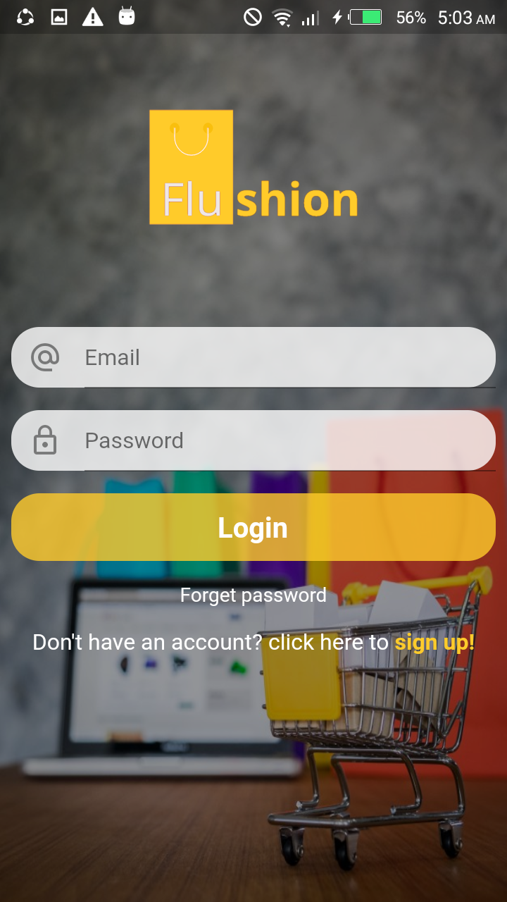
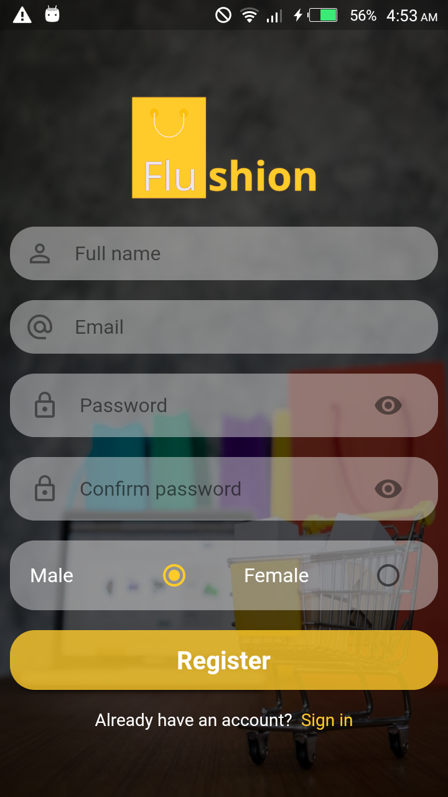
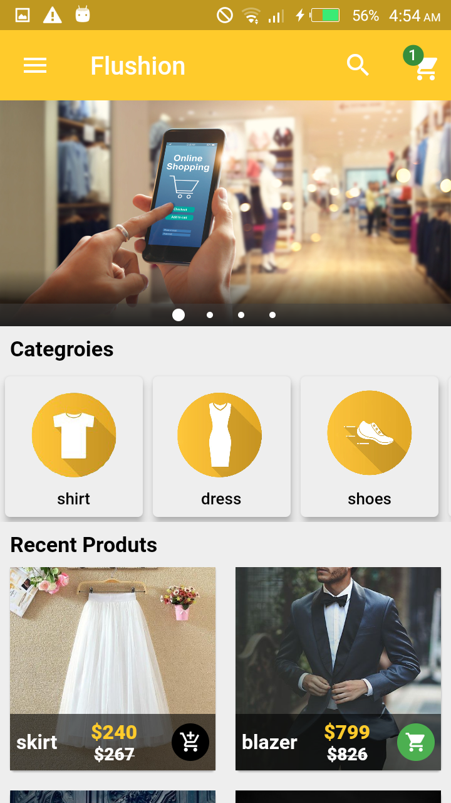
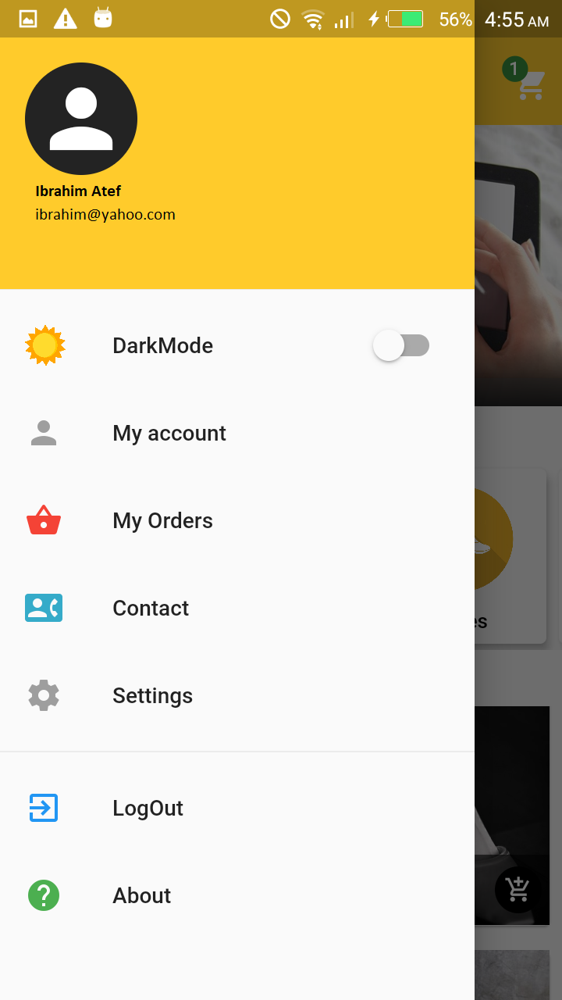
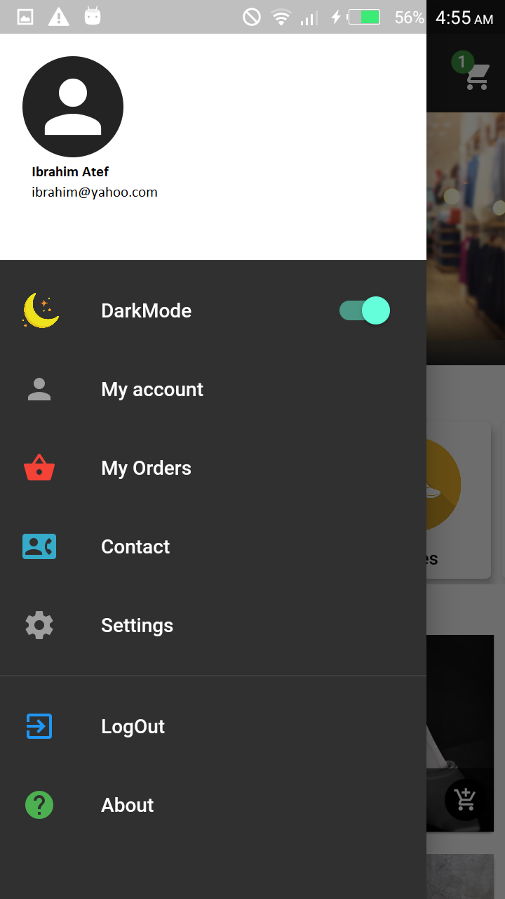
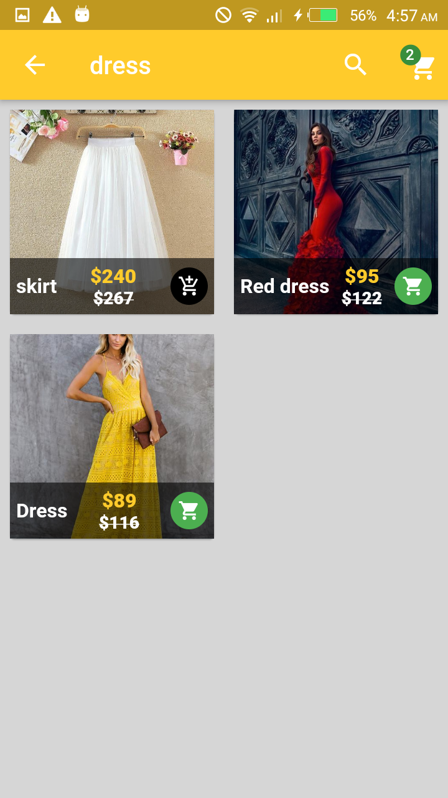
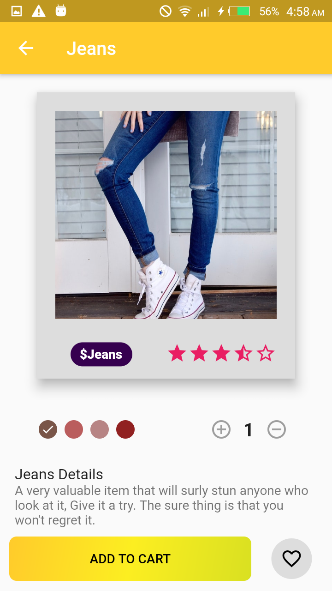
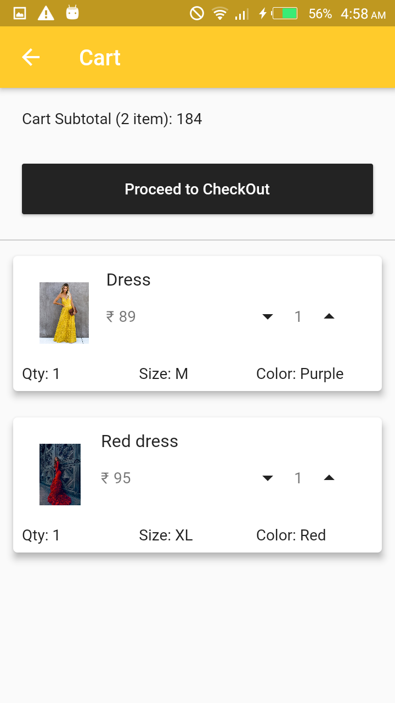
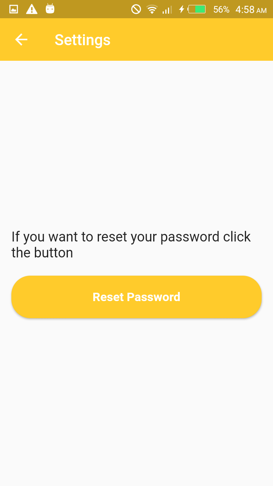
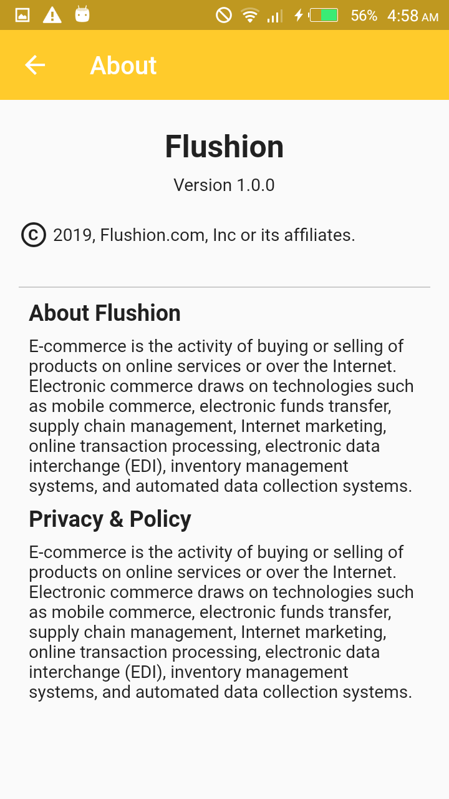

# Flutter---Ecommerce-App -- Under Construction

An e-commerce app which is made with Flutter and Dart

 You can shop for the latest fashion on the move! With hundreds of daily new arrivals of leading brands in categories such as Skirts, blouse, blazers, and shoes for women and men

### Features:
1. Login, Logout and Signup using Firebase
2. Manage and personalize your account.
3. Beautiful UI with Carousel and nice Color combinations.
4. Offline Capabilities (using SQFLite Database).
5. Dynamic theming switch between Dark and Light mode
6. Find the products you need with search capability
7. Navigation between diffrent screens and categories
8. Choose your product colors and sizes and quantities
8. Add items to your shopping cart and save them for later.
9. Manage your cart , edit and delete your orders list.

### ScreenShots:

   

  

  

  
